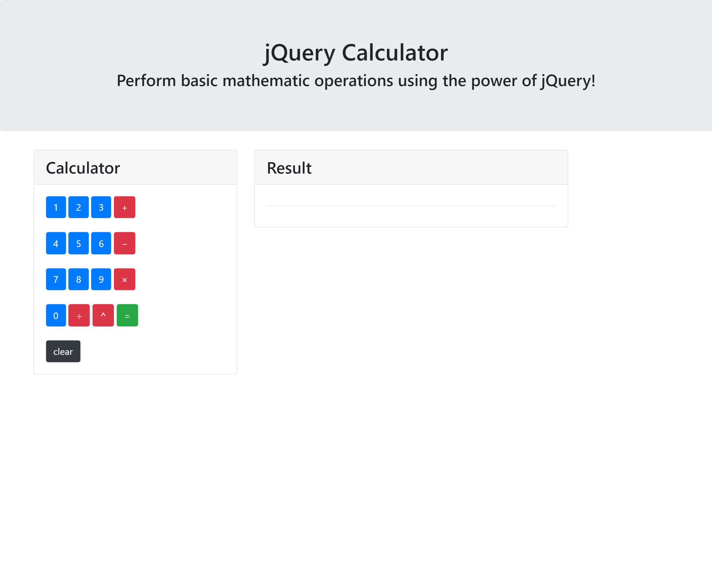

# Portfolio

## Who made this project?

I did!

## What is this project for?

I made this project as an offshoot of a class activity in the UCSD Extension Full Stack Web Development course. The class solution to this small project was over 100 lines of JavaScript with several functions and many event handlers.
I wanted to see if I could make this calculator work with one function and only a few event handlers. So I did. Here it is.

## Why did I make this project?

I did this project to simply challenge myself and try to simplify and minimize a long and convoluted code.

### Guide

Hopefully you know how to use a calculator...